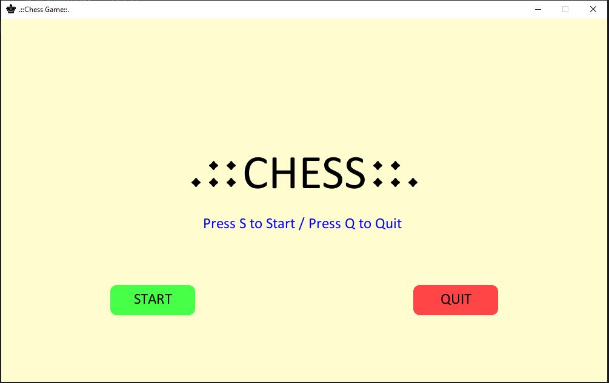
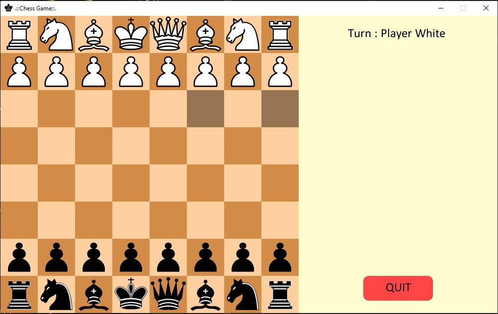
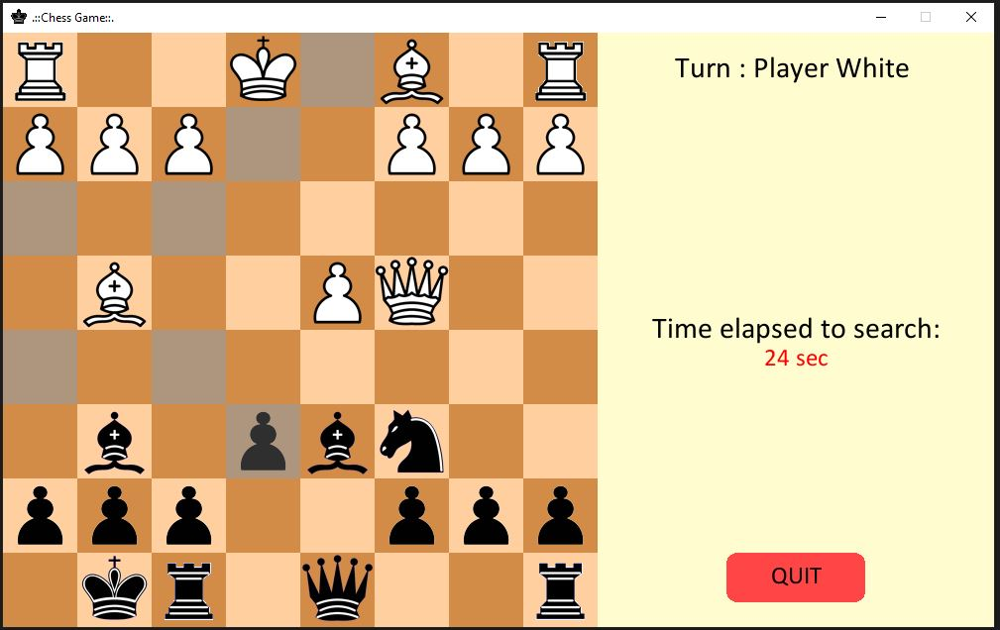
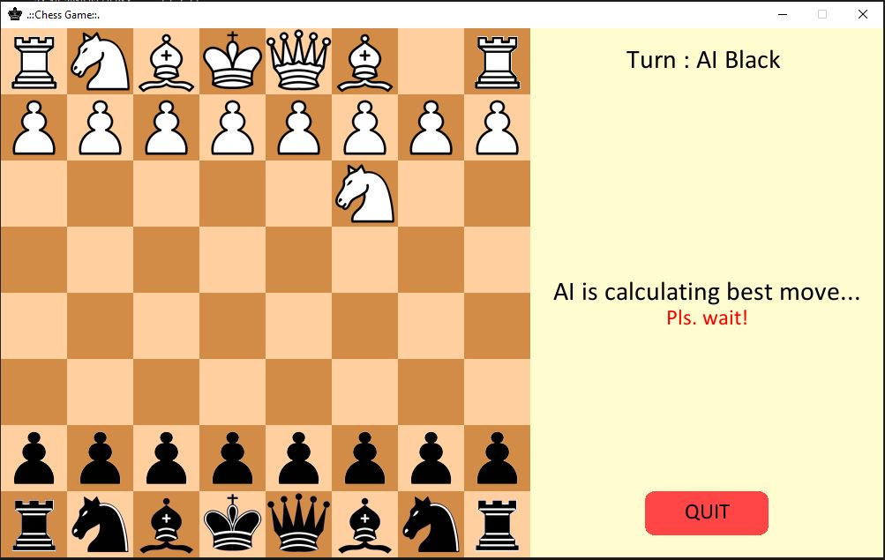
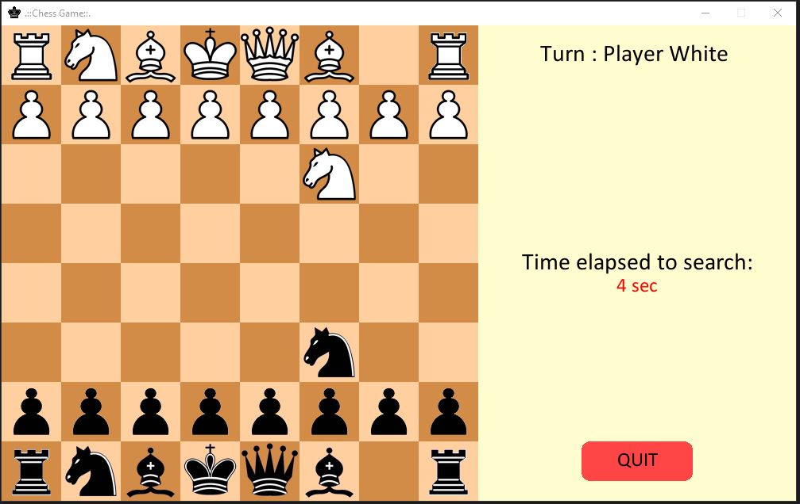
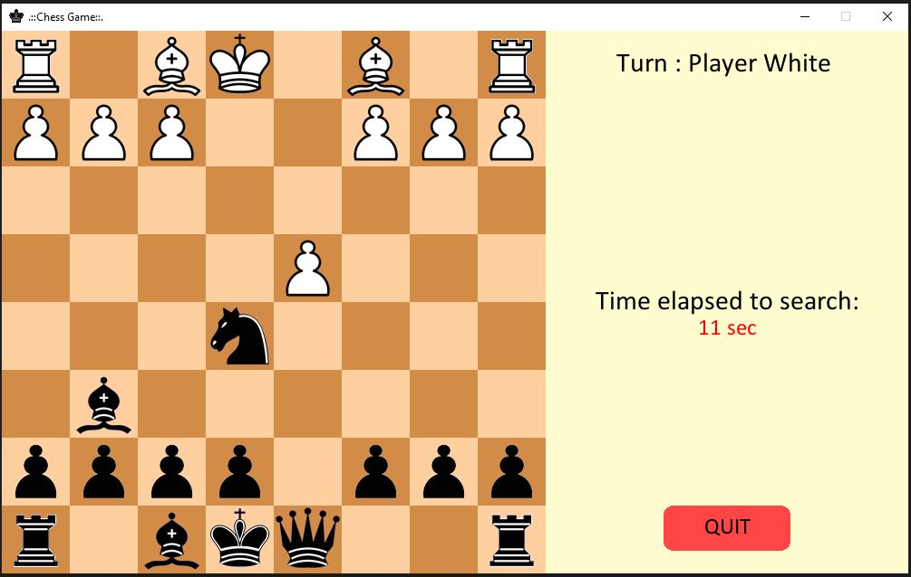
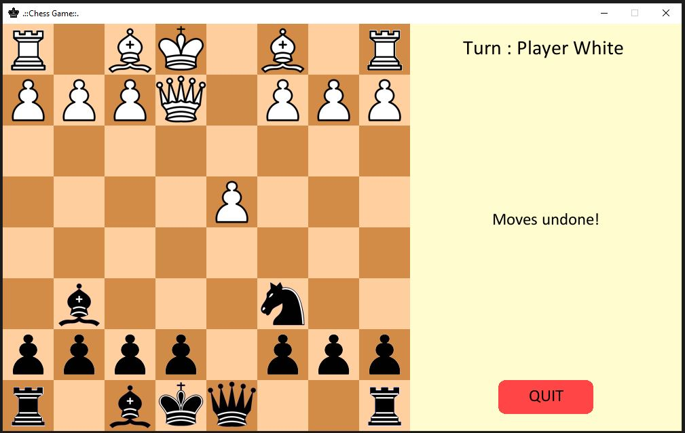
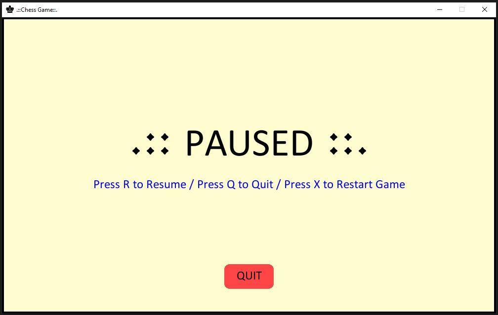
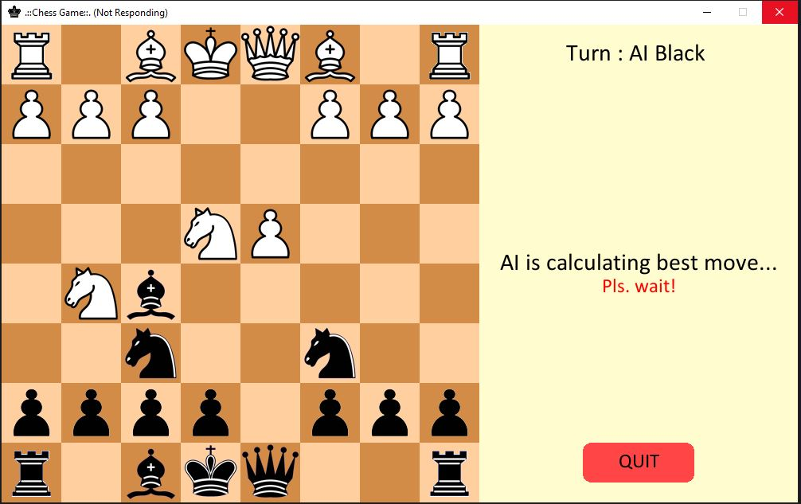

# Chess Game
Chess is one of the world’s most popular and the oldest strategic board game played. Over the years many organizations and communities have taken many efforts to create a AI that calculates the best possible move for maximising it's own probability/profit to win while maximising the opponents probability to Lose.    

## Overview
This repository contains the 2-player chess and AI chess game implemented in Python programming language. In addition to this it also contains the executable files (in folders `2-Player Chess EXE` and `AI Chess EXE`) for the same so that any user can play the game without having to download Python and rest of the dependencies required to run the python scripts.
<br>
## Download and Play?
#### Windows:
1.  [Click to Download AI Chess .](https://drive.google.com/drive/folders/1_ZUq4O-vf4sQeMYSGwchKfc7MvtDg6Zn?usp=sharing) 
2.  [Click to Download 2 player Chess.](https://drive.google.com/drive/folders/1Py8Vt4Dg-B9vY3i0wEr9hOyDS2YdXV9s?usp=sharing)

## Functionalities offered in game?
Steps to be followed:
<br><br>1. Press **P** to pause game play.
<br><br>2. Press **Q** to Quit game play. (Works during game play as well as on Pause screen.)
<br><br>3. Press **U** to undo a move played by player/user (White Player).
<br><br>4. Press **X** to restart the game. (Works only when on Pause screen.)
<br><br>5. Press **R** to resume game play. (Works only when on Pause screen.)
<br>

## Guide on Gameplay UI :
1. Welcome Screen
<br><br>

<br><br>
2. After Pressing **S** or **START** button, you can start playing right off the bat. User is Player WHITE and AI is player BLACK.
<br><br>

<br><br>
3. To get all the possible moves of a particular piece, just click that piece and all the possible will be highlighted in gray. For example, by clicking the bishop:
<br><br>

<br><br>
4. To play a move Click and drag that particular piece to a gray shaded area (possible playable position).
<br><br>

<br><br>
5. After playing a move the AI searches for the best possible move, It shows a message *AI is calculating best move...Pls.wait!* .
<br><br>

<br><br>
6. After AI finishes calculating move the time taken to search the move is displayed.
<br><br>

<br><br>
7. If you wish to **UNDO** the move played Press **U** and it will also a confirmation message `Moves undone!`. For example, when I move the queen forward where it can be attacked by a the opponents Horse :
<br><br>

<br><br>

<br><br>
8. Press **P** to display Pause Screen. 
<br><br>

<br><br>
9. It may happen that when you play a move the game play window may stop responding. And this is because the program is still searching the best possible move. ****So Please do not cancel or close the window, the move is being calculated and searched and it WILL be played!****
<br><br>

<br>
<hr>
<br>

## How to play AI Chess game?
Steps to be followed:
<br><br>1. Download or Clone the repository.
<br><br>2. Extract all the contents of this zip file downloaded. 
<br><br>3. <b>Navigate</b> to `AI Chess EXE folder` , which contains the executable (*AIChess.exe*) file that can be run on Windows OS without the user/player downloading any dependencies.
<br><br>4. Double Click or Run " **AIChess.exe** " to play the game.
<br><hr><br>
## How to play two player Chess game?
Steps to be followed:
<br><br>1. Download or Clone the repository.
<br><br>2. Extract all the contents of this zip file downloaded. 
<br><br>3. <b>Navigate</b> to `2-Player Chess EXE folder` , which contains the executable (*Chess2player.exe*) file that can be run on Windows OS without the user/player downloading any dependencies.
<br><br>4. Open or Run " **Chess2player.exe** " to play the game.
<br><br>****Enjoy!****

## Approach

Mini-Max Algorithm is used to search the best possible move playable by AI to maximise its own probability of winning and maximising the opponents probability of losing. Moreover the rank/weight/profit of the piece at each position of the board is used to calculate the best move. Python programming language was used to implement this. Pygame module was used for GUI, wherein user can drag pieces to play a move. Since the search algorithm is slow in finding move, so in order to speed things up the `python-chess` library (https://github.com/niklasf/python-chess) was used for the gameplay backend for getting the chess notations and possible moves. Thereby reducing the time taken for calculating users possible moves, game board updation, and played moves updation. *Significant time and resource reduction.* 
<br><br>
To run the python scripts the folowing modules need to be pre-installed:<br>
```
pip install pygame 
pip install python-chess
```
<br>
The ranks or the weights that the algorithm uses for searching move is as follows: 
<br>
```
pawn_table =    [0, 0, 0, 0, 0, 0, 0, 0,
                 50, 50, 50, 50, 50, 50, 50, 50,
                 10, 10, 20, 30, 30, 20, 10, 10,
                 5, 5, 10, 25, 25, 10, 5, 5,
                 0, 0, 0, 20, 20, 0, 0, 0,
                 5, -5, -10, 0, 0, -10, -5, 5,
                 5, 10, 10, -20, -20, 10, 10, 5,
                 0, 0, 0, 0, 0, 0, 0, 0]
knight_table = [-50, -40, -30, -30, -30, -30, -40, -50,
                -40, -20, 0, 0, 0, 0, -20, -40,
                -30, 0, 10, 15, 15, 10, 0, -30,
                -30, 5, 15, 20, 20, 15, 5, -30,
                -30, 0, 15, 20, 20, 15, 0, -30,
                -30, 5, 10, 15, 15, 10, 5, -30,
                -40, -20, 0, 5, 5, 0, -20, -40,
                -50, -90, -30, -30, -30, -30, -90, -50]
bishop_table = [-20, -10, -10, -10, -10, -10, -10, -20,
                -10, 0, 0, 0, 0, 0, 0, -10,
                -10, 0, 5, 10, 10, 5, 0, -10,
                -10, 5, 5, 10, 10, 5, 5, -10,
                -10, 0, 10, 10, 10, 10, 0, -10,
                -10, 10, 10, 10, 10, 10, 10, -10,
                -10, 5, 0, 0, 0, 0, 5, -10,
                -20, -10, -90, -10, -10, -90, -10, -20]
rook_table =   [ 0, 0, 0, 0, 0, 0, 0, 0,
                 5, 10, 10, 10, 10, 10, 10, 5,
                -5, 0, 0, 0, 0, 0, 0, -5,
                -5, 0, 0, 0, 0, 0, 0, -5,
                -5, 0, 0, 0, 0, 0, 0, -5,
                -5, 0, 0, 0, 0, 0, 0, -5,
                -5, 0, 0, 0, 0, 0, 0, -5,
                 0, 0, 0, 5, 5, 0, 0, 0]
queen_table =  [-20, -10, -10, -5, -5, -10, -10, -20,
                -10, 0, 0, 0, 0, 0, 0, -10,
                -10, 0, 5, 5, 5, 5, 0, -10,
                -5, 0, 5, 5, 5, 5, 0, -5,
                 0, 0, 5, 5, 5, 5, 0, -5,
                -10, 5, 5, 5, 5, 5, 0, -10,
                -10, 0, 5, 0, 0, 0, 0, -10,
                -20, -10, -10, 70, -5, -10, -10, -20]
king_table =   [-30, -40, -40, -50, -50, -40, -40, -30,
                -30, -40, -40, -50, -50, -40, -40, -30,
                -30, -40, -40, -50, -50, -40, -40, -30,
                -30, -40, -40, -50, -50, -40, -40, -30,
                -20, -30, -30, -40, -40, -30, -30, -20,
                -10, -20, -20, -20, -20, -20, -20, -10,
                 20, 20, 0, 0, 0, 0, 20, 20,
                 20, 30, 10, 0, 0, 10, 30, 20]
king_endgame_table = [-50, -40, -30, -20, -20, -30, -40, -50,
                      -30, -20, -10, 0, 0, -10, -20, -30,
                      -30, -10, 20, 30, 30, 20, -10, -30,
                      -30, -10, 30, 40, 40, 30, -10, -30,
                      -30, -10, 30, 40, 40, 30, -10, -30,
                      -30, -10, 20, 30, 30, 20, -10, -30,
                      -30, -30, 0, 0, 0, 0, -30, -30,
                      -50, -30, -30, -30, -30, -30, -30, -50]
```

<br>

### Future Improvements:
Using Alpha-beta Pruning algorithm to further reducing time taken to search moves. Use of Reinforced Learning or a Deep Learning based approach to compute best move to be played and to achieve a high accuracy in minimum amount of time.

<br><hr>


